# DevOps for ECS Hands-On Lab

> **본 Hands on Lab은 Oregon region( us-west-2 ) 을 기준으로 작성되었습니다. 실습을 하실 때 반드시 리전을 확인하기 바랍니다.**

# Prerequisites

본격적으로 실습을 시작하기에 앞서 준비작업이 필요합니다. 관리권한의 IAM User 생성과 Cloud9 작업 환경이 준비되어 있는 경우, **CDK 로 인프라 및 ECS 클러스터 생성하기** 단계로 넘어가셔도 좋습니다.

## IAM User 생성하기

1. AWS 계정을 가지고 있지 않다면 :[클릭하여 AWS 계정을 만듭니다](https://aws.amazon.com/getting-started/)

2. AWS 계정을 가지고 있다면 AWS 계정에 대한 관리자 권한이 있는 IAM 사용자로서 나머지 작업장 단계를 수행합니다: [실습을 위하여 새로운 IAM 사용자를 만듭니다](https://console.aws.amazon.com/iam/home?#/users$new)

3. 사용자 상세 내역을 입력합니다.

    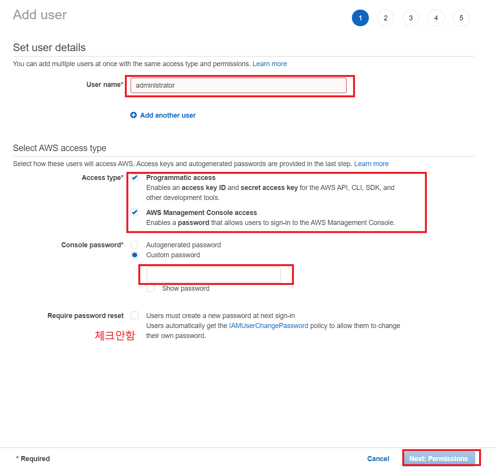

4. AdministratorAccess IAM 정책을 추가합니다.

     

5. Create User 버튼을 클릭해서 사용자를 생성합니다.

     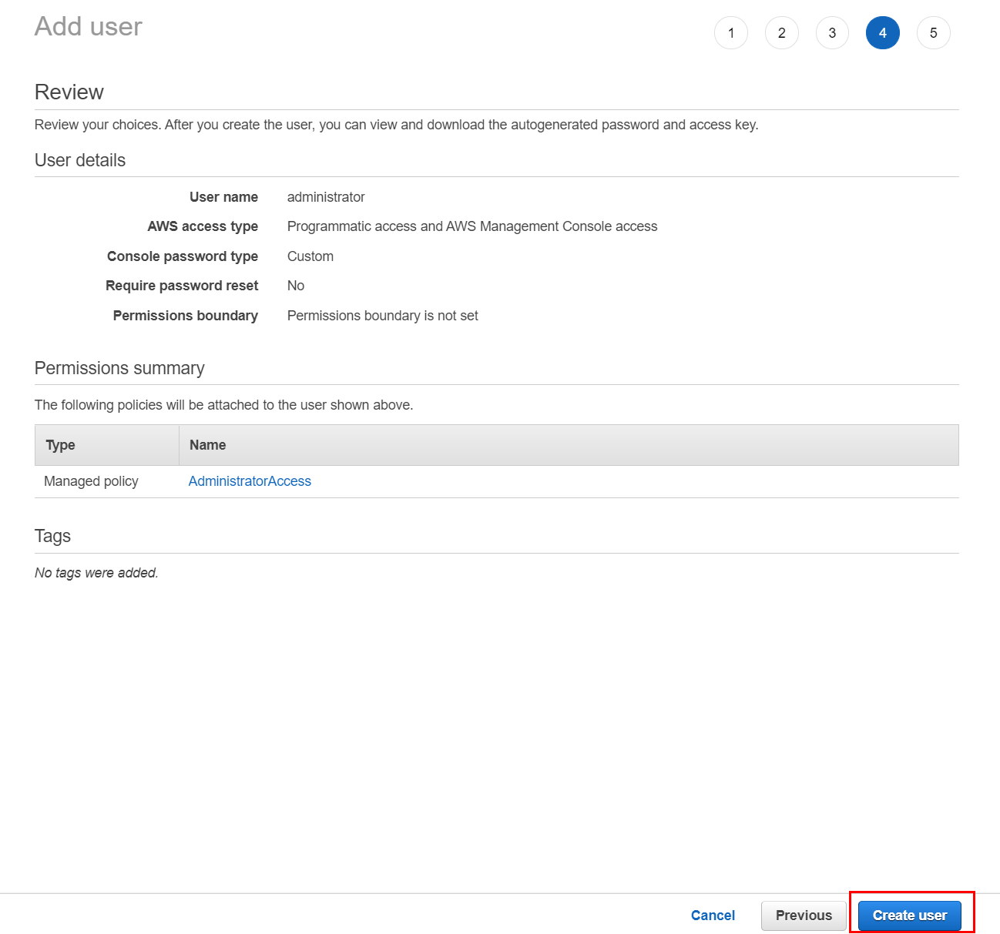

6. 로그인을 위한 URL을 메모해둡니다.

     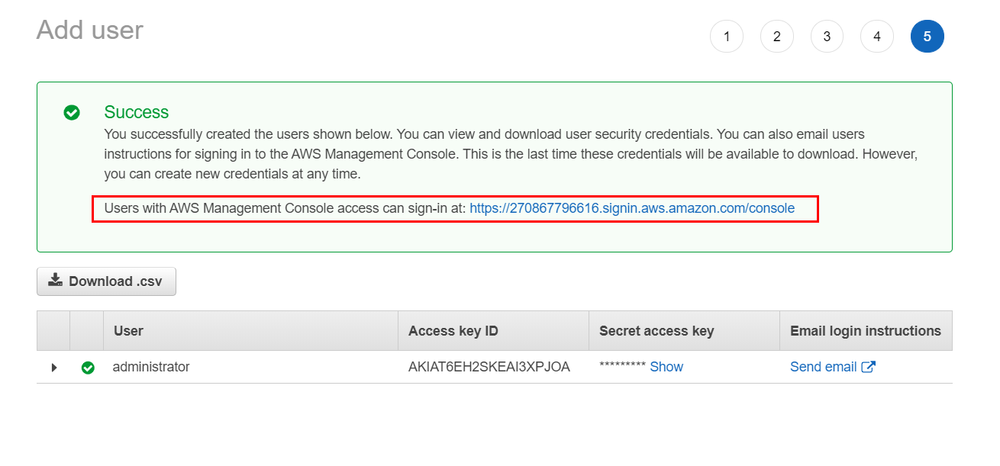
	 
	 
## Cloud9 워크스페이스 생성하기

> **Cloud9 워크스페이스는 루트 계정 사용자가 아니라 관리자 권한을 가진 IAM 사용자가 생성해야 합니다. 루트 계정 사용자가 아닌 IAM 사용자로 로그인했는지 확인하세요.**
>
> **클라우드 9 도메인에 대해 Ad blocker나 자바스크립트 해제기 및 추적 차단기가 작동되면 워크스페이스에 연결하는데 영향을 끼칠 수 있습니다. Cloud9에는 타사 쿠키가 필요하여 도메인을 [화이트리스트로 만들 수 있습니다.](https://docs.aws.amazon.com/cloud9/latest/user-guide/troubleshooting.html#troubleshooting-env-loading)**

1. 이 실습은 Oregon region을 활용해서 이루어 질 것 입니다. 다음의 링크로 이동하여 Cloud9 워크 스페이스를 생성합니다.

    [https://us-west-2.console.aws.amazon.com/cloud9/home?region=us-west-2](https://us-west-2.console.aws.amazon.com/cloud9/home?region=us-west-2)

2. Create environment 버튼을 클릭합니다.
3. Name 에 devopshol 등과 같은 형식으로 입력합니다. 다른 항목은 디폴트로 내버려둡니다.
4. 워크스페이스 생성이 되면 welcome 탭을 닫고 새로운 터미널을 열어서 개발 환경을 커스터 마이징 합니다.

     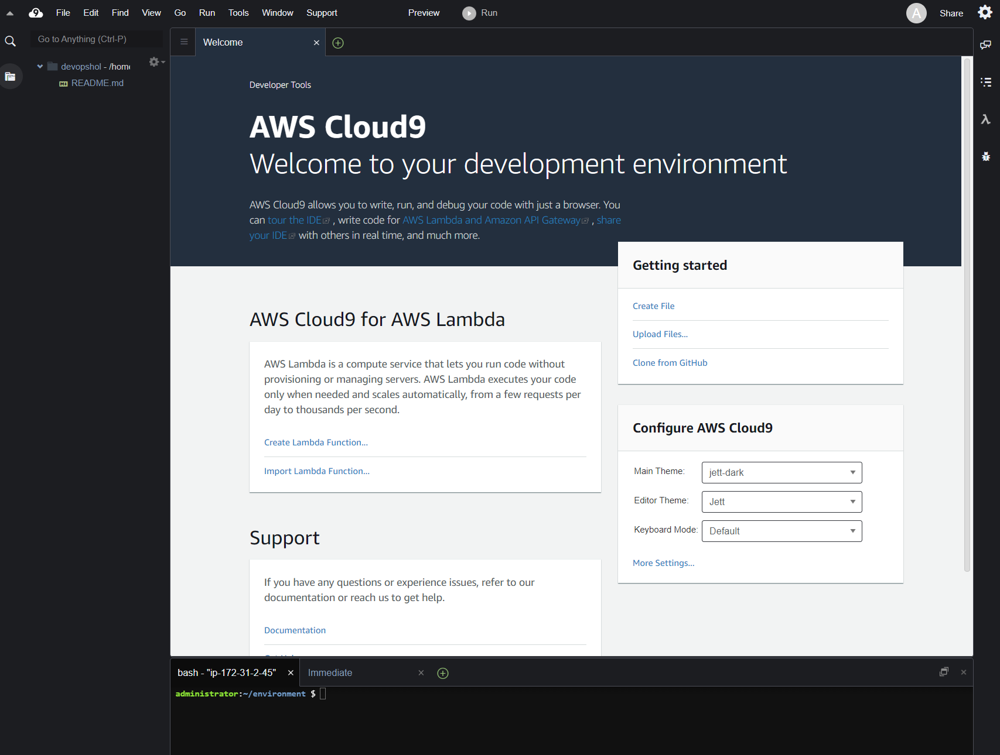

5. 여러분의 워크스페이스는 다음과 같아 보여야합니다.:

     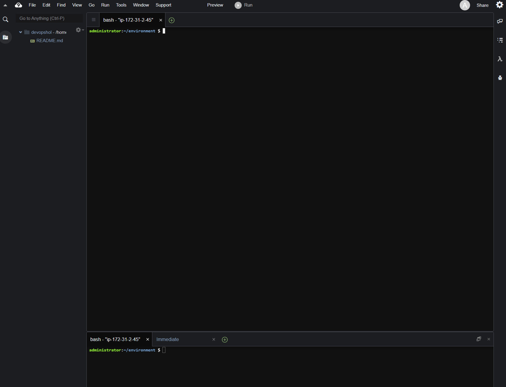

# 전체 아키텍처

본 HOL 통해서 아래와 같은 아키텍처를 구성합니다. 이번 실습을 통하여 CDK 로 인프라스트럭처와 ECS 클러스터를 생성하고 Code Pipeline으로 파이프라인을 생성하여 지속적으로 소스를 빌드하고 배포합니다.

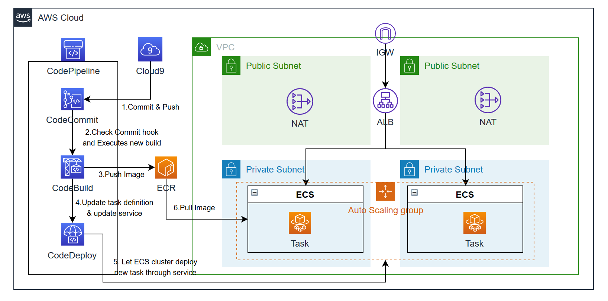
	
# CDK 로 인프라 및 ECS 클러스터 생성하기

> **여기서는 cdk init을 사용해서, 타입스크립트를 사용하는 새로운 AWS CDK 프로젝트를 생성할 것입니다.**
>
> **또한 CDK Toolkit를 사용해서 샘플 앱을 배포하는 AWS CloudFormation 템플릿을 만드는 방법, 계정에 CDK 어플리케이션을 배포하는 방법을 살펴봅니다.**

## CDK INIT

1. 터미널에서 신규 디렉토리를 생성합니다.

	```bash
	mkdir cdk-ecs && cd cdk-ecs
	```
	
2. 새로운 TypeScript CDK 프로젝트를 생성하기 위해 cdk init 명령을 실행합니다.

	```bash
	cdk init --language typescript
	```
	
	실행 결과는 다음과 같습니다. (시스템에 git이 설치 되지 않은 경우, git repository 초기화와 관련된 경고가 나올 수 있습니다. 워크샵 실행에는 문제가 되지 않으니 계속 진행합니다)

	```bash
	Applying project template app for typescript
	# Welcome to your CDK TypeScript project!

	This is a blank project for TypeScript development with CDK.

	The `cdk.json` file tells the CDK Toolkit how to execute your app.

	## Useful commands

	 * `npm run build`   compile typescript to js
	 * `npm run watch`   watch for changes and compile
	 * `npm run test`    perform the jest unit tests
	 * `cdk deploy`      deploy this stack to your default AWS account/region
	 * `cdk diff`        compare deployed stack with current state
	 * `cdk synth`       emits the synthesized CloudFormation template
	```
	
	실행 결과에는 유용한 cdk 커맨드가 포함되어 있습니다.

## NPM RUN WATCH

TypeScript로 작성된 소스는 JavaScript로 컴파일 과정이 필요합니다. 소스 코드 변경 시 매번 .js 파일 형식으로 컴파일을 진행해야 합니다.

1. npm watch 스크립트를 실행할 **새로운 터미널 세션**을 엽니다.

2. 프로젝트 경로로 이동합니다.

	```bash
	cd cdk-ecs
	```

3. 프로젝트에는 cdk init 과정을 거치며 watch라는 npm 스크립트가 설정되어 있습니다. 다음 명령을 실행합니다.

	```bash
	npm run watch
	```
	
4. 창 전체 내용이 갱신되어, 다음 내용을 확인할 수 있습니다.

	```bash
	[12:55:24 AM] File change detected. Starting incremental compilation...

	[12:55:24 AM] Found 0 errors. Watching for file changes.
	```

	npm run watch 실행 시 TypeScript 컴파일러(tsc)를 "watch" 모드로 시작합니다. 이 모드에서는 프로젝트 경로를 모니터링 하고,  변경된 내용이 포함된 .ts파일이 발생하면 .js파일로 자동 컴파일 합니다.

	**!! 실습 종료전까지는 watch 명령을 실행중인 터미널 창을 열어둡니다.**
	
## 프로젝트 구조

프로젝트의 경로 구조는 다음과 같습니다.

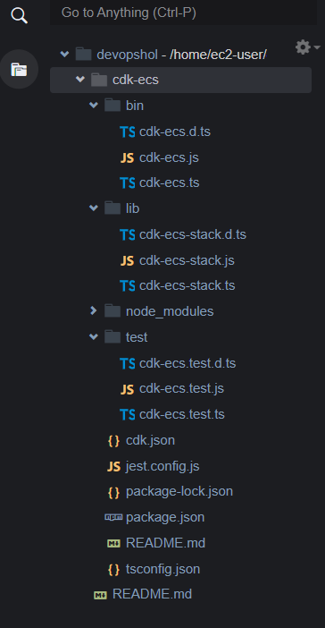

	> bin/cdk-ecs.ts 는 CDK 앱의 진입점입니다. 
	> package.json은 npm 모듈의 설정 파일입니다. 앱의 이름, 버전, 종속성, 빌드 스크립트(예, "watch", "build")등의 정보를 포함합니다. package-lock.json은 npm으로 설치되는 패키지에 대한 의존성을 가지고 있는 파일입니다. npm에 의해 자동으로 생성되고 관리되기 때문에 별도로 신경을 쓰지 않으셔도 됩니다
	> cdk.json은 CDK 툴킷에 앱을 실행하는 방법을 설정합니다. 실습에서는 "npx ts-node bin/cdk-ecs.ts"가 됩니다.
	> tsconfig.json에는 TypeScript 설정 정보가 있습니다.
	> .gitignore는 코드 형상관리 시스템에 포함시키지 않을 파일을 설정합니다. .npmignore는 패키지 매니저에 모듈을 배포할때 제외할 파일을 설정합니다.
	> node_modules은 npm이 관리하며 프로젝트 종속성에 관련된 파일을 저장합니다.

lib/cdk-ecs-stack.ts 파일을 열어보십시오. 우리 어플리케이션의 중요한 부분이 여기에 정의될 것입니다.
	
## CDK 패키지 설치 및 코드 수정

Network, ECS 를 생성하기 위해 필요한 CDK 패키지를 설치하고, 스택에서 생성할 리소스를 위한 TypeScript 코드를 수정합니다.

1. 아래 명령어를 터미널창에서 실행하여 필요한 cdk 패키지를 설치합니다.

	```bash
	npm install @aws-cdk/aws-ec2 --save
	npm install @aws-cdk/aws-ecs –save
	npm install @aws-cdk/aws-ecs-patterns --save
	```	
	
2. 프로젝트 루트 디렉토리에 imgsrc 디렉토리를 생성하고 그 아래 파일을 생성합니다.

	**Dockerfile** 생성 (Web 요청을 처리할 NGINX 컨테이너 이미지 설정)
	
	```bash
	FROM nginx:latest
	RUN  echo '<h1>DevOps HoL</h1>' \
	>> index.html
	RUN cp /index.html /usr/share/nginx/html
	```	
	
3. lib/cdk-ecs-stack.ts 파일의 내용을 아래의 코드로 변경합니다.

	```bash
	import * as cdk from '@aws-cdk/core';
	import * as ec2 from '@aws-cdk/aws-ec2';
	import * as ecs from '@aws-cdk/aws-ecs';
	import * as ecs_patterns from '@aws-cdk/aws-ecs-patterns';

	export class CdkEcsStack extends cdk.Stack {
	  
		vpc: ec2.Vpc;
		cluster: ecs.Cluster;
	  
	  	constructor(scope: cdk.Construct, id: string, props?: cdk.StackProps) {
		super(scope, id, props);

			// Network
			this.vpc = new ec2.Vpc(this, 'vpc', {
				maxAzs: 2,
				natGateways: 1
			});

			// ECS cluster
			this.cluster = new ecs.Cluster(this, 'cluster', {
				vpc: this.vpc
			});
			
			// Fargate Pattern
			const ecsapp = new ecs_patterns.ApplicationLoadBalancedFargateService(this, 'ecsapp', {
				cluster: this.cluster,
				taskImageOptions: {
				image: ecs.ContainerImage.fromAsset('../imgsrc'),
				enableLogging: true,
				},
				desiredCount: 2,
				cpu: 512,
				memoryLimitMiB: 1024,
				publicLoadBalancer: true
			});
	  }
	}
	```	
	
	Fargate 스택 생성에는 CDK의 상위 레벨 생성자인 CDK 패턴을 사용합니다. 유용한 패턴에 대한 생성자를 제공하는 CDK 패턴을 이용해 다중 리소스를 한번에 생성할 수 있습니다.

	Fargate 스택에서 생성하는 리소스의 상세 정보는 다음과 같습니다.
	
		- Application Load Balancer가 앞단에 붙은 ECS에서 동작하는 Fargate 서비스
		- Public Application Load Balancer 생성로컬 경로(./api)에 있는 Dockerfile을 이용해 컨테이너 이미지를 생성
		- 생성된 이미지를 기반으로 태스크 정의
		- 정의된 태스크를 기반으로 2개의 컨테이너 구성
		- CloudWatch 로깅 환경 구성
		- CPU, Memory 제약 설정
		- 관련 CDK 코드

## 리소스 합성

스택에서 사용한 코드로 실제 인프라스트럭처를 생성해 보겠습니다. 

1. CDK 앱에서 정의한 코드에 대한 CloudFormation 템플릿을 생성하기 위해 **cdk synth** 명령어를 실행합니다.

	```bash
	cdk synth
	```
	
2. 실행 결과로 CloudFormation 템플릿이 출력되고 다음 리소스들이 포함되어 있습니다.

	- AWS::ElasticLoadBalancingV2
	- AWS::ECS::TaskDefinition
	- AWS::Logs::LogGroup
	- AWS::ECS::Service

## 배포

사용자의 AWS 환경(계정/리전)에서 AWS CDK 앱을 최초 실행하는 경우 bootstrap 스택의 설정이 필요합니다(이 단계는 매번 실행하실 필요는 없습니다). bootstrap 스택에는 툴킷 운영과 관련된 리소스들이 포함되어 있습니다. 예를 들어, bootstrap 스택에는 배포과정에 사용되는 템플릿과 에셋을 저장하는 S3 버킷이 포함되어 있습니다.

1. **cdk bootstrap** 명령어를 실행하여 boostrap 스택을 사용자 환경에 설치합니다.

	```bash
	cdk bootstrap
	```
	
	실행결과는 다음과 같습니다.

	```bash
	Bootstrapping environment aws://9999999999/us-west-2...
	```

	> 기존 AWS CDK 앱 실행 과정에서, AWS 환경(계정/리전)에 bootstrap 스택이 구성된 경우는 반복 구성하실 필요 없습니다.
	> Access Denied 에러가 발생한 경우, AWS CLI가 제대로 설치되지 않았거나 사용중인 AWS 프로파일에 cloudformation:CreateChangeSet 권한이 있는지 확인이 필요합니다.

2. CDK 앱 배포를 위해 **cdk deploy** 명령을 실행합니다.

	```bash
	cdk deploy
	```

	명령을 실행하면 다음과 같은 경고 메시지가 표시됩니다.
	
	```bash
	This deployment will make potentially sensitive changes according to your current security approval level (--require-approval broadening).
	Please confirm you intend to make the following modifications:

	IAM Statement Changes
	┌───┬────────────────────────────────────────┬────────┬────────────────────────────────────────┬──────────────────────────────────────────┬───────────┐
	│   │ Resource                               │ Effect │ Action                                 │ Principal                                │ Condition │
	├───┼────────────────────────────────────────┼────────┼────────────────────────────────────────┼──────────────────────────────────────────┼───────────┤
	│ + │ ${ecsapp/TaskDef/ExecutionRole.Arn}    │ Allow  │ sts:AssumeRole                         │ Service:ecs-tasks.amazonaws.com          │           │
	├───┼────────────────────────────────────────┼────────┼────────────────────────────────────────┼──────────────────────────────────────────┼───────────┤
	│ + │ ${ecsapp/TaskDef/TaskRole.Arn}         │ Allow  │ sts:AssumeRole                         │ Service:ecs-tasks.amazonaws.com          │           │
	├───┼────────────────────────────────────────┼────────┼────────────────────────────────────────┼──────────────────────────────────────────┼───────────┤
	│ + │ ${ecsapp/TaskDef/web/LogGroup.Arn}     │ Allow  │ logs:CreateLogStream                   │ AWS:${ecsapp/TaskDef/ExecutionRole}      │           │
	│   │                                        │        │ logs:PutLogEvents                      │                                          │           │
	├───┼────────────────────────────────────────┼────────┼────────────────────────────────────────┼──────────────────────────────────────────┼───────────┤
	│ + │ *                                      │ Allow  │ ecr:GetAuthorizationToken              │ AWS:${ecsapp/TaskDef/ExecutionRole}      │           │
	├───┼────────────────────────────────────────┼────────┼────────────────────────────────────────┼──────────────────────────────────────────┼───────────┤
	│ + │ arn:${AWS::Partition}:ecr:${AWS::Regio │ Allow  │ ecr:BatchCheckLayerAvailability        │ AWS:${ecsapp/TaskDef/ExecutionRole}      │           │
	│   │ n}:${AWS::AccountId}:repository/aws-cd │        │ ecr:BatchGetImage                      │                                          │           │
	│   │ k/assets                               │        │ ecr:GetDownloadUrlForLayer             │                                          │           │
	└───┴────────────────────────────────────────┴────────┴────────────────────────────────────────┴──────────────────────────────────────────┴───────────┘
	Security Group Changes
	┌───┬─────────────────────────────────────────┬─────┬────────────┬─────────────────────────────────────────┐
	│   │ Group                                   │ Dir │ Protocol   │ Peer                                    │
	├───┼─────────────────────────────────────────┼─────┼────────────┼─────────────────────────────────────────┤
	│ + │ ${ecsapp/LB/SecurityGroup.GroupId}      │ In  │ TCP 80     │ Everyone (IPv4)                         │
	│ + │ ${ecsapp/LB/SecurityGroup.GroupId}      │ Out │ TCP 80     │ ${ecsapp/Service/SecurityGroup.GroupId} │
	├───┼─────────────────────────────────────────┼─────┼────────────┼─────────────────────────────────────────┤
	│ + │ ${ecsapp/Service/SecurityGroup.GroupId} │ In  │ TCP 80     │ ${ecsapp/LB/SecurityGroup.GroupId}      │
	│ + │ ${ecsapp/Service/SecurityGroup.GroupId} │ Out │ Everything │ Everyone (IPv4)                         │
	└───┴─────────────────────────────────────────┴─────┴────────────┴─────────────────────────────────────────┘
	(NOTE: There may be security-related changes not in this list. See https://github.com/aws/aws-cdk/issues/1299)

	Do you wish to deploy these changes (y/n)? 
	```
	
	이 경고 메시지는 앱을 배포하게 되면 발생할 수 있는 위험 요소를 표시합니다. 실습에 필요한 S3에 대한 퍼블릭 접근 권한 허용에 대한 허용입니다. **y** 를 입력하여 스택을 배포하고 관련된 자원을 생성합니다.
	
	Base 스택 배포가 정상적으로 이루어진 경우 다음과 같은 출력 메시지가 표시됩니다. ACCOUNT-ID는 사용자의 어카운트 ID, REGION은 앱이 생성된 리전, STACK-ID는 스택의 고유 식별자가 표시됩니다.

	```bash
	CdkEcsStack: creating CloudFormation changeset...

	   CdkEcsStack

	Outputs:
	CdkEcsStack.ecsappServiceURL3973F0E2 = http://CdkEc-ecsap-1UWVC20NABHD-1936266020.us-west-2.elb.amazonaws.com
	CdkEcsStack.ecsappLoadBalancerDNS5062C85D = CdkEc-ecsap-1UWVC20NABHD-1936266020.us-west-2.elb.amazonaws.com

	Stack ARN:
	arn:aws:cloudformation:us-west-2:270867796616:stack/CdkEcsStack/52a47720-c24a-11ea-8c45-02e40fd26800	
	```
	
## CloudFormation 콘솔

CDK 앱은 AWS CloudFormation을 통해 배포됩니다. 각 CDK 스택은 CloudFormation 스택과 1:1로 매핑됩니다. AWS CloudFormation 콘솔에 접근하여 생성된 CdkEcsStack 스택을 확인합니다. 문제가 있는 경우는 리전 정보가 맞는지 확인합니다.

> 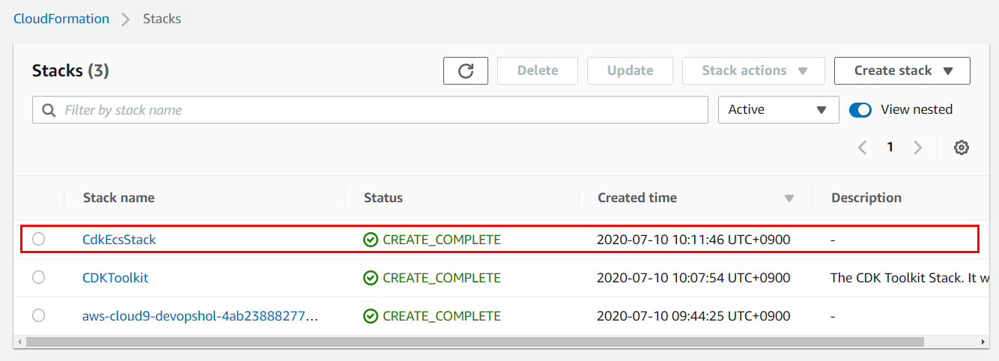

Resources 탭을 선택하면, 생성된 리소스의 Physical ID를 확인할 수 있습니다.

> 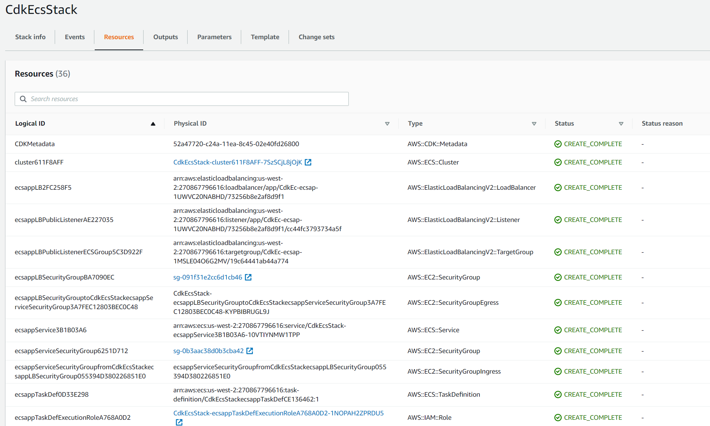

# AWS CodeSeries 로 ECS CICD 파이프라인 만들기

> **여기서는 개발환경(IDE)의 어플리케이션 코드를 AWS CodeCommit 리포지토리와 연결하고 AWS의 CodeSeries 서비스로 ECS CICD 파이프라인을 만드는 방법을 살펴봅니다.**
>
> **또한 코드 변경시 CodePipeline을 통해 변경된 코드를 자동으로 서비스에 배포하는 실습을 해봅니다.**

# CodeCommit 리포지토리 생성하기

1. 다음의 링크에서 [https://console.aws.amazon.com/codesuite/codecommit/home](https://console.aws.amazon.com/codesuite/codecommit/home) 에서 CodeCommit 콘솔을 엽니다.

2. Repositories 페이지에서 Create repository를 선택합니다.

3. 리포지토리 생성 페이지의 Name에 **devopshol** 등과 같이 입력합니다. 이미 존재하는 repository면 다른 이름을 넣어서 생성합니다.

4. (선택 사항) 설명에 리포지토리 설명을 입력합니다. 그러면 사용자들이 리포지토리의 용도를 식별하는 데 도움이 됩니다.

5. Create를 버튼을 클릭하여 리포지토리를 생성합니다.

## Code Commit에서 사용할 HTTPS Git Credential(자격증명) 생성하기

1. AWS Management 콘솔에 로그인한 [다음 링크를 클릭해서 IAM 콘솔을 엽니다](https://console.aws.amazon.com/iam/). CodeCommit 접속을 위해 Git 자격 증명을 생성 및 사용할 IAM 사용자로 로그인해야 합니다.

2. IAM 콘솔의 탐색 창에서 Users(사용자)를 선택하고 사용자 목록에 기존에 작성하셨던 유저명 혹은 **Administrator** 을 선택합니다.

3. AWS CodeCommit 자격 증명 탭을 선택합니다. 그리고 하단에 있는 Generate Git Credentials 버튼을 클립합니다.

     

4. IAM이 생성한 사용자 이름과 암호를 복사하는 방법은 로컬 컴퓨터에 있는 안전한 파일에 표시, 복사 후 붙여넣기하거나 자격 증명 다운로드를 선택하여 .CSV 파일로 이 정보를 다운로드하는 두 가지가 있습니다. CodeCommit에 접속하려면 이 정보가 필요합니다. Download credentials 버튼을 눌러서 CSV 파일로 저장해두록 합니다.

    

     > **이때가 사용자 이름과 암호를 저장할 수 있는 유일한 기회입니다.** 이 정보를 저장하지 않는 경우, 사용자 이름은 IAM 콘솔에서 복사할 수 있지만 암호는 찾을 수 없습니다. 그러므로 암호를 재설정한 후 저장해야 합니다.

## CodeCommit 콘솔 연결 및 리포지토리 복제

1. [https://console.aws.amazon.com/codesuite/codecommit/home](https://console.aws.amazon.com/codesuite/codecommit/home) 에서 CodeCommit 콘솔을 엽니다.

2. 오른쪽 상단에서 리전 선택메뉴에서 Oregon 리전을 선택합니다. 리포지토리는 한 AWS 리전에 국한됩니다.

3. 목록에서 연결하려는 리포지토리명을 클릭합니다. 그러면 해당 리포지토리의 코드 페이지가 열립니다.

4. 우측 상단의 Clone URL > Clone HTTPs 버튼을 눌러서 Git 리포지토리 URL을 복사합니다.

    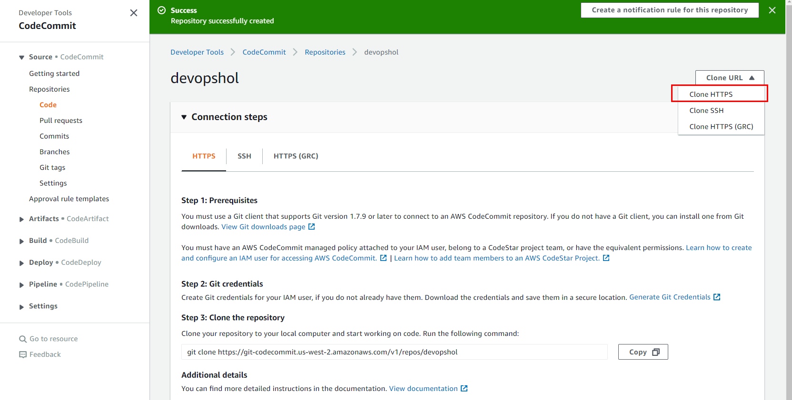

5. Cloud9 의 터미널 화면으로 이동 후, 아래 명령어로 environment 디렉토리로 이동합니다.

	```bash
	cd ~/environment
	```
	
6. 터미널 화면에서 위의 4에서 복사한 명령어를 붙여넣고 실행합니다.

    ```bash
	git clone https://git-codecommit.us-west-2.amazonaws.com/v1/repos/devopshol
	```
	
	그럼 다음과 같은 화면을 볼 수 있습니다.
	
	```bash
	Cloning into 'devopshol'...
	warning: You appear to have cloned an empty repository.
	Username for 'https://git-codecommit.us-west-2.amazonaws.com':
    ```

7. Code Commit에서 사용할 HTTPS Git Credential(자격증명) 생성하기 항목에서 생성한 Git Credential 파일을 열어서 User Name과 Password를 보고 터미털에 복사해서 붙여넣기 합니다. 정상적으로 입력했다면 다음과 같은 화면을 볼 수 있습니다.

	```bash
     warning: You appear to have cloned an empty repository.
	```

8. 정상적으로 Code Commit 리포지토리를 생성하였으며 테스트를 완료했습니다.

# Code Commit Repository에 Dockefile 및 buildspec.yaml 추가하기

## buildspec.yaml 추가하기

1. Cloud9 의 터미널 창에서 다음의 명령어를 실행하여 앞서 생성된 Git 디렉토리로 이동합니다.

    ```bash
    cd devopshol
    ```

2. 다음의 명령어를 실행하여 git repository의 상태를 확인합니다.

    ```bash
    git status
    ```

    다음과 같이 출력이 됩니다.

    ```bash
    On branch master

    No commits yet

    nothing to commit (create/copy files and use "git add" to track)
    ```

3. 다음의 명령어를 실행하여 imgsrc 디렉토리의 Docker 파일을 복사 해옵니다.

	```bash
	cp ~/environment/imgsrc/Dockerfile ./
	```
	
4. 워크스페이스의 왼쪽 메뉴 탐색창에서 repository의 디렉토리를 선택하고 마우스 오른쪽 버튼을 눌러서 New File 메뉴를 눌러 새로운 파일을 추가합니다. 다시 오른쪽 버튼을 눌러 Rename을 선택하고 파일 이름을 **buildspec.yml** 로 지정합니다.

	> 대소문자에 유의해서 입력합니다. 파일명은 **buildspec.yml** 입니다.

	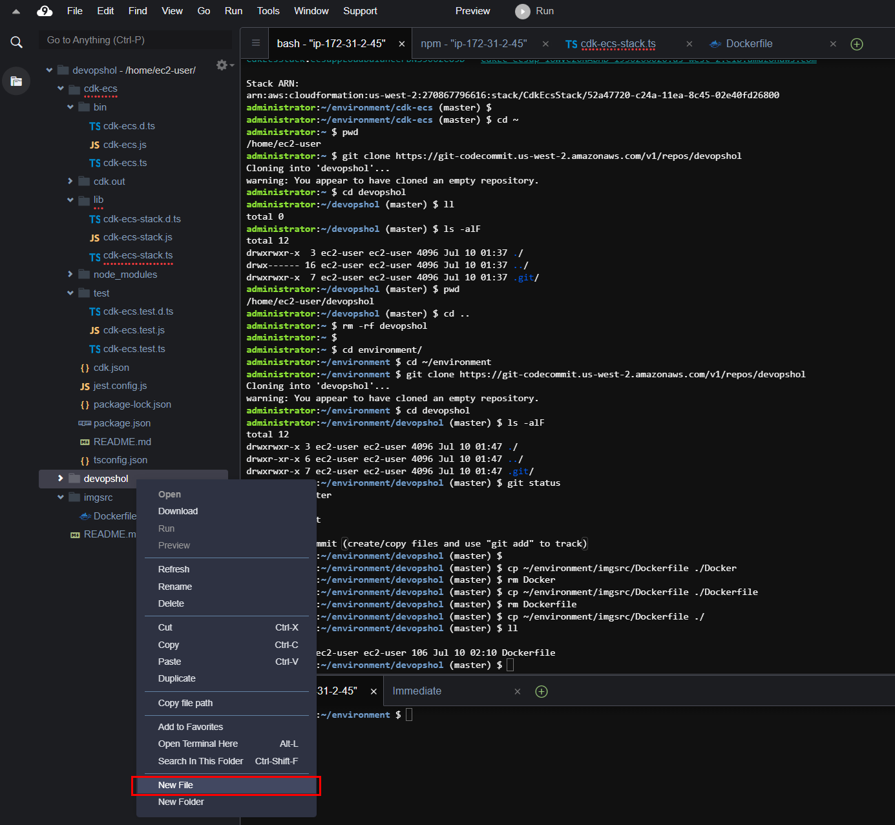

5. buildspec.yml 을 더블클릭해서 편집창을 열고 다음의 내용을 복사하여 붙여넣고 저장합니다.

    > 들여쓰기 및 띄워쓰기 간격이 아래의 텍스트와 동일하도록 입력합니다!

    ```yaml
    version: 0.2

    phases:
      pre_build:
        commands:
          - echo Logging in to Amazon ECR...
          - aws --version
          - $(aws ecr get-login --region $AWS_DEFAULT_REGION --no-include-email)
          - REPOSITORY_URI=270867796616.dkr.ecr.us-west-2.amazonaws.com/aws-cdk/assets 
          - COMMIT_HASH=$(echo $CODEBUILD_RESOLVED_SOURCE_VERSION | cut -c 1-7)
          - IMAGE_TAG=${COMMIT_HASH:=latest}
      build:
        commands:
          - echo Build started on `date`
          - echo Building the Docker image...
          - docker build -t $REPOSITORY_URI:latest .
          - docker tag $REPOSITORY_URI:latest $REPOSITORY_URI:$IMAGE_TAG
      post_build:
        commands:
          - echo Build completed on `date`
          - echo Pushing the Docker images...
          - docker push $REPOSITORY_URI:latest
          - docker push $REPOSITORY_URI:$IMAGE_TAG
          - echo Writing image definitions file...
          - printf '[{"name":"web","imageUri":"%s"}]' $REPOSITORY_URI:$IMAGE_TAG > imagedefinitions.json
    artifacts:
        files: imagedefinitions.json
    ```

6. phases -> pre_build -> commands 의 4번째 라인의 "\<YOUR_ACCOUNT_ID\>" 대신에 본인의 AWS 어카운트 ID를 입력하고 앞에서 생성한 ECR 리포지토리의 주소를 입력합니다. 다음과 같은 형식이 됩니다.

    > "- REPOSITORY_URI=9999999999.dkr.ecr.us-west-2.amazonaws.com/aws-cdk/assets"

7. phases -> post_build -> commands 의 마지막 라인의 printf 의 name 이 컨테이너의 이름과 일치하는지 확인합니다.

	Cloud9의 워크스페이스에서 Task Definition 을 List 합니다.

	```bash
	aws ecs list-task-definitions
	```
	
	List 된 Task Definition 으로 상세 내역을 확인 합니다. Task Definition 에서 Version 을
	
	```bash
	aws ecs describe-task-definition --task-definition <Task Definition>
	```
	
	Output 은 다음과 같습니다. 결과 창에 taskDefinition -> containerDefinitions -> name 에서 컨테이너 이름을 찾을 수 있습니다.
	
	```bash
	{
		"taskDefinition": {
			"taskDefinitionArn": "arn:aws:ecs:us-west-2:270867796616:task-definition/CdkEcsStackecsappTaskDefCE136462:1",
			"containerDefinitions": [
				{
					"name": "web",
					"image": "9999999999.dkr.ecr.us-west-2.amazonaws.com/aws-cdk/assets:7355c642ffb4f29ad3270368c55c04c3ed2032deec01c23e9720a87f05477f9d",
	```
	
8. buildspec 및 Dockerfile 파일을 커밋한 후에 소스 리포지토리에 푸쉬 합니다. 다음을 참조하여 username과 email 주소를 설정합니다.

    - 현재 디렉토리가 Git repository 클론된 디렉토리가 맞는지 확인합니다.

    ```bash
	pwd
    cd ~/environment/devopshol
    ```

    - git crendential을 저장하기 위하여 다음과 같이 user name과 email을 글로벌로 설정합니다.

    ```bash
    git config --global user.name "devops amazon"
    git config --global user.email "example@amazon.com"
    ```

    - 파일을 추가합니다.

    ```bash
    git add .
    ```

    - 변경 내용을 커밋합니다.

    ```bash
    git commit -m "Adding build specification and docker file"
    ```

    - 커밋을 푸시합니다. 앞에서 Code Commit 리포지토리를 만들때 다운로드 받아뒀던 csv 파일을 참조하여 유저네임과 패스워드를 입력합니다.

    ```bash
    git config credential.helper store
    git push origin master
    ```

    - 다음과 같은 화면을 볼 수 있습니다.

    ```bash
	Counting objects: 4, done.
	Compressing objects: 100% (4/4), done.
	Writing objects: 100% (4/4), 841 bytes | 841.00 KiB/s, done.
	Total 4 (delta 0), reused 0 (delta 0)
	To https://git-codecommit.us-west-2.amazonaws.com/v1/repos/devopshol
	 * [new branch]      master -> master
    ```

9. 다음 링크를 통해서 이동하여 정상적으로 푸쉬된 파일들을 확인해 봅니다. [https://us-west-2.console.aws.amazon.com/codesuite/codecommit/repositories?region=us-west-2](https://us-west-2.console.aws.amazon.com/codesuite/codecommit/repositories?region=us-west-2)

# Cope Pipeline을 생성하여 ECS에 지속적인 배포하기

    CodePipeline 마법사를 사용하여 파이프라인 단계를 생성하고, 소스 리포지토리를 ECS 서비스에 연결합니다.

## Code Pipeline으로 새로운 파이프라인 생성

1. [https://console.aws.amazon.com/codepipeline/](https://console.aws.amazon.com/codepipeline/) 에서 CodePipeline 콘솔을 엽니다.

2. 시작 페이지에서 Create Pipeline (파이프라인 생성) 을 선택합니다.

3. CodePipeline를 처음으로 사용하는 경우 Welcome 페이지 대신 소개 페이지가 나타납니다. 지금 시작을 선택합니다.

## 단계별로 입력하기

1. 이름 페이지의 파이프라인 이름 상자에 해당 파이프라인 이름을 입력한 후 다음 단계를 선택합니다. 이 자습서에서 파이프라인 이름은 **devopshol** 입니다. 나머지 항목은 디폴트로 둡니다.

    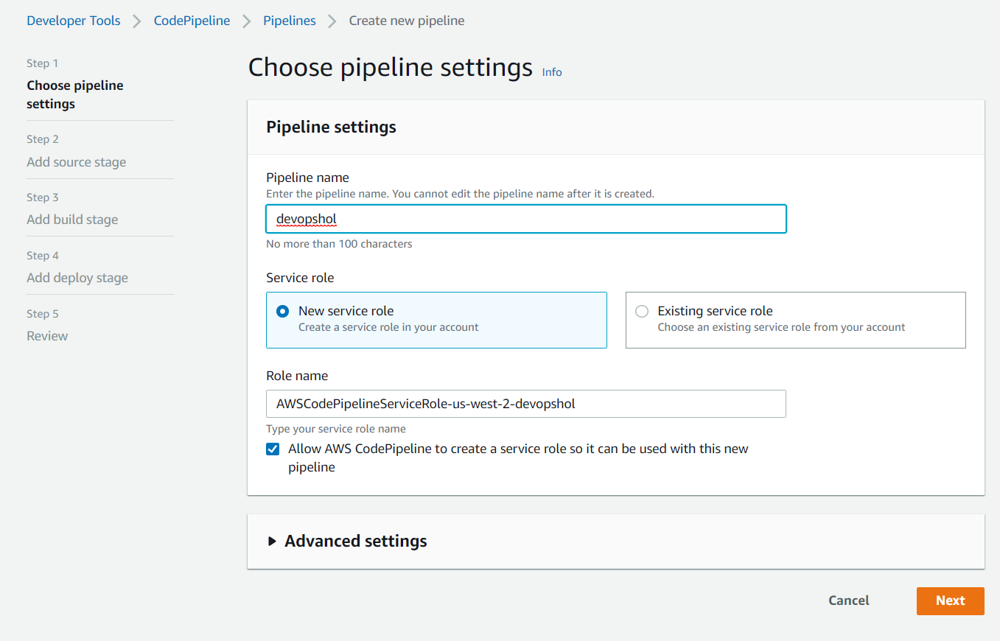

2. Add Source Stage에서는 다음과 같이 입력을 하고 Next 버튼을 누릅니다.

    - Source provider: **AWS CodeCommit**

    - Repository name: **devopshol**

    - Branch Name: **master**

    - Change detection options: **Amazon CloudWatch Events (Recommended)**

3. Add build stage에서는 다음과 같이 입력을 하고 Next 버튼을 누릅니다.
  
    - Build provider: **AWS CodeBuild**
    - Region: **US West - (Oregon)**
    - Project name 오른쪽의 Create a new build project를 선택합니다. 빌드 프로젝트 생성시에는 다음과 같이 입력 및 선택을 하고 나머지는 디폴트로 둡니다
        - Project Name: devops-hol
        - Environment Image: **Managed Image**
        - Operating System: **Ubuntu**
        - Runtime: **Standard**
        - Image: **aws/codebuild/standard:1.0**
        - **Privileged 옵션 체크**
        > **Privileged 옵셥을 체크하지 않는다면 Code build에서 도커 이미지를 빌드할 수 없습니다**
        - Continue to CodePipeline 버튼을 누릅니다
    - Add build stage 화면으로 돌아와 Next버튼을 누릅니다
        > 마법사가 빌드 프로젝트에 대해 codebuild-devopshol-service-role과 같은 형식의 CodeBuild 서비스 역할을 생성합니다. 이 역할 이름은 나중에 Amazon ECR 권한을 역할에 추가할 때 필요하므로 메모해 둡니다.

4. Add to deploy stage에서는 다음과 같이 선택 합니다. 나머지는 디폴트로 남겨둡니다.
    - Deploy provider : **Amazon ECS**
    - Region: **US West (Oregon) **
    - Cluster name: **CdkEcsStack-clusterxxxxxxxxxx**
    - Service name: **CdkEcsStack-ecsappServicexxxxxxxxxx**

5. 리뷰 페이지에서 파이프라인 구성을 검토하고 Create Pipeline(파이프라인 생성)을 선택하여 파이프라인을 생성합니다.

    > 이제 파이프라인이 생성되었으며 다른 파이프라인 단계에서 이 파이프라인이 실행하려고 시도합니다. 하지만 마법사가 만든 기본 CodeBuild 역할이 buildspec.yml 파일에 포함된 모든 명령을 실행할 수 있는 권한을 갖고 있지 않으므로 빌드 단계가 실패합니다. 다음 단계에서는 빌드 단계를 위한 권한을 추가합니다.

## CodeBuild 역할에 Amazon ECR 권한을 추가하기

1. [https://console.aws.amazon.com/iam/](https://console.aws.amazon.com/iam/)에서 IAM 콘솔을 엽니다.

2. 왼쪽 탐색 창에서 역할을 선택합니다.

3. 검색란에 codebuild-를 입력하고 CodePipeline 마법사가 생성한 역할을 선택합니다. 이 핸즈온랩에서의 역할이름은 **codebuild-devopshol-service-role**입니다.

4. Summary(요약) 페이지에서 Attach policies (정책 연결)을 선택합니다.

5. AmazonEC2ContainerRegistryPowerUser 정책 왼쪽의 상자를 선택하고 Attach policy ( 정책 연결 )을 선택합니다.

## 파이프라인 테스트하기

1. 다음의 링크로 [https://us-west-2.console.aws.amazon.com/codesuite/codepipeline/pipelines?region=us-west-2](https://us-west-2.console.aws.amazon.com/codesuite/codepipeline/pipelines?region=us-west-2) 이동하여 devopshol 을 선택하고 오른쪽 상단의 release changes를 선택합니다.

    

2. 파이프라인이 배포까지 정상적으로 수행되면 다음과 같은 화면을 볼 수 있습니다.

    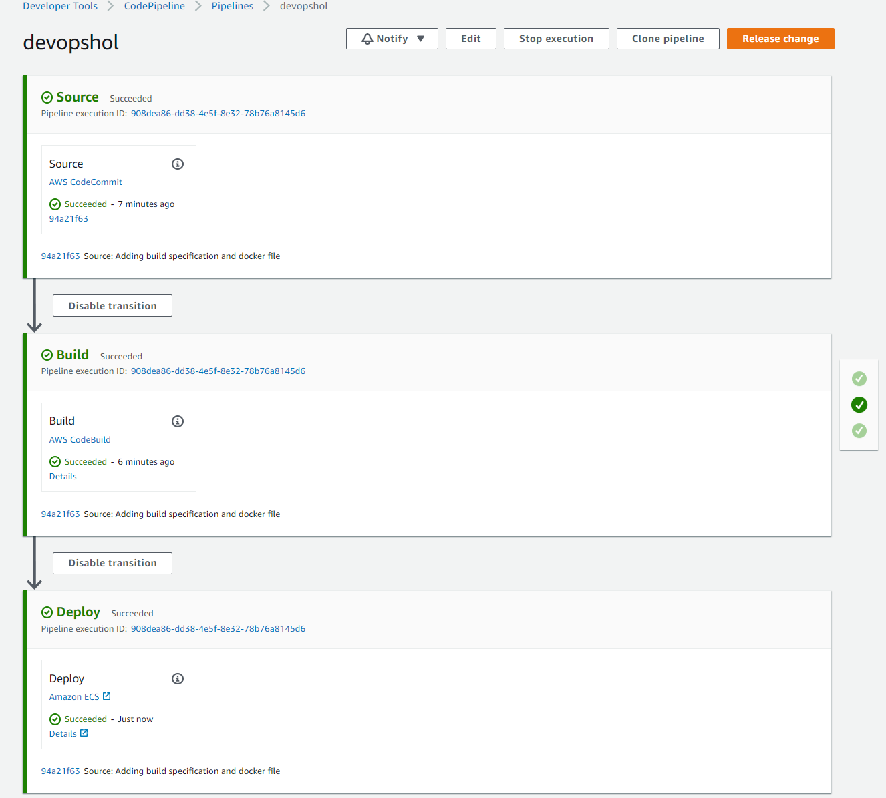

3. 정상적으로 배포되었다면 [https://us-west-2.console.aws.amazon.com/ec2/v2/home?region=us-west-2#LoadBalancers:sort=loadBalancerName](https://us-west-2.console.aws.amazon.com/ec2/v2/home?region=us-west-2#LoadBalancers:sort=loadBalancerName) 에서 CdkEc로 시작하는 LB를 선택한후에 Description 탭의 DNS name을 복사하여 웹 브라우저에 붙여넣고 "DevOps HoL"가 정상적으로 뜨는지 확인합니다. 변경사항이 반영되지 않은 경우 페이지 새로 고침 F5 을 해보시기 바랍니다.

4. 이번에는 구성된 소스 리포지토리에 대한 코드를 변경하고 커밋한 후 변경 사항을 푸시합니다. Cloud9 워크 스페이스에서 왼쪽의 탐색창에서 Dockerfile을 찾아서 더블 클릭하여 편집창을 열고 다음과 같이 수정합니다.

   - 다음과 같이 수정합니다.
	```bash
	FROM nginx:latest
	RUN  echo '<h1>DevOps HoL v2</h1>' \
	>> index.html
	RUN cp /index.html /usr/share/nginx/html
	```

5. Cloud9의 워크 스페이스에서 다음과 같은 명령어로 다시 소스를 커밋하고 푸쉬합니다.

   - 소스를 추가하고 커밋합니다.

    ```bash
	cd ~/environment/devopshol
    git commit -am "modify html"
    ```

   - 커밋을 푸시합니다. 앞에서 Code Commit 리포지토리를 만들때 다운로드 받아뒀던 csv 파일을 참조하여 유저네임과 패스워드를 입력합니다.
    
    ```bash
    git config credential.helper store
    git push origin master
    ```

6. 정상적으로 푸쉬가 되었다면 commit hook으로 인하여 Code Pipeline이 자동으로 실행이 됩니다.

7. [https://us-west-2.console.aws.amazon.com/ec2/v2/home?region=us-west-2#LoadBalancers:sort=loadBalancerName](https://us-west-2.console.aws.amazon.com/ec2/v2/home?region=us-west-2#LoadBalancers:sort=loadBalancerName) 로 이동하여 CdkEc로 시작하는 LB를 선택한 후에 Description 탭의 DNS name을 복사하여 웹 브라우저에 붙여넣고 "DevOps HoL v2"가 정상적으로 뜨는지 확인합니다. 변경사항이 반영되지 않은 경우 페이지 새로 고침 F5 을 해보시기 바랍니다.

실습을 완료하였습니다.

## 실습후 리소스 삭제하기 (Event Engine으로 진행했을 경우에는 생략)

> Event Engine을 통해서 실습을 한 경우에는 리소스들을 삭제할 필요가 없습니다. 이 랩을 진행하는 SA가 직접 모든 리소스들을 삭제합니다.

> 실습후 반드시 리소스들을 삭제합니다. 제대로 삭제를 하지 않는 다면 귀하의 계정으로 요금이 청구될 수 있습니다. 실습때 받은 credit이 있다면 등록을 해주시길 바랍니다.

1. CodePipeline 삭제
	- CodePipieline, BuildProject, CodeCommit
2. S3 Bucket 삭제
	- CodePipeline 버킷
3. CDK 리소스 삭제
	- Cdk-ecs 디렉토리에서 cdk destroy '*'
4. ECR repositories 삭제
5. Cloud9 삭제
6. CloudFormation 삭제
